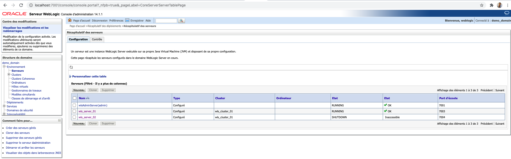
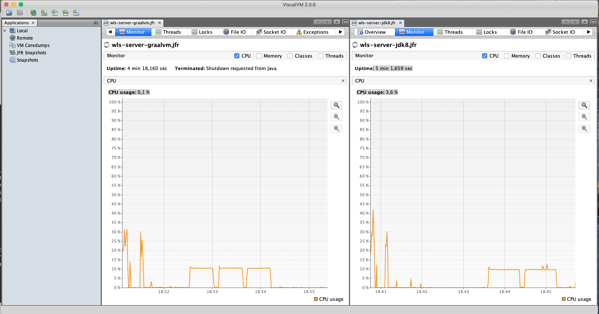

# Accelerating Weblogic workloads with GraalVM EE


## Setup GraalVM 

## Setup Weblogic Domain
Setup a Basic Weblogic 14.1.1 Domain using the [following instructions ](https://docs.oracle.com/en/middleware/standalone/weblogic-server/14.1.1.0/wldcw/creating-weblogic-domain.html#GUID-CD179827-4696-48F8-BD39-22099432D860)
The domain has one Administration server and two Managed instances wls


## Deploy the benchmark Application 

Clone and build the demo application from Github
```git clone https://github.com/nelvadas/graalvm-weblogic-jaxrs-demo.git
cd  graalvm-weblogic-jaxrs-demo 
mvn clean install
```

Deploy the WAR on Managed instance wls_server_01


## Run Benchmarks
The benchmark app we are running is a simple JAX-RS Web Service provided by  
[marthenlt](https://github.com/marthenlt/graalvm-weblogic-jaxrs-demo).
The source code is pretty simple  and rely on Java Stream to compute and arithmetic expression.


### Start the Admin server 
```
cd $DOMAIN_ROOT/bin
./startWebLogic.sh
```

### Weblogic with Oracle JDK 8 

Edit the Managed server startup options in `$DOMAIN_ROOT/bin/startManagedWebLogic.sh`
Add the following option
```
    export JAVA_OPTIONS="${JAVA_OPTIONS} -XX:+UnlockCommercialFeatures -XX:+FlightRecorder -XX:StartFlightRecording=duration=300s,filename=/Users/nono/JFR/wls-server-jdk8.jfr"
```

Start the Server 
```./startManagedWebLogic.sh wls_server_01  http://localhost:7001```

The server is listening on port 7003.

Run the benchmark 03 times

Test1: 
```
 ./run-test.sh 
Testing with 200,000,000 (200 millions) iterations
Time taken to complete in milliseconds: 45187 ; and result is: 30000000000
real    0m45.251s
user    0m0.005s
sys     0m0.010s

```

Test2: 
```
 /run-test.sh 
Testing with 200,000,000 (200 millions) iterations
Time taken to complete in milliseconds: 46254 ; and result is: 30000000000
real    0m46.274s
user    0m0.006s
sys     0m0.010s

```

Test3:

``` 
./run-test.sh
Testing with 200,000,000 (200 millions) iterations
Time taken to complete in milliseconds: 46418 ; and result is: 30000000000
real    0m46.431s
user    0m0.006s
sys     0m0.007s

```


### Weblogic with GraalVM EE 21.0.0

After running the benchmarks with the default Java 8, we are  now running the same test  on the same server
with GraalVM as Java Runtime.
First stop the runninw `wls_server_01` Managed instance 

Duplicate the running script 

```cp startManagedWebLogic.sh startManagedWebLogicWithGraalVM.sh ```

Customize it with the following instructions
Add the following line  the `$DOMAIN_ROOT/bin/startManagedWebLogicWithGraalVM.sh`  in order
to include Flight Recorder.

```
    export JAVA_OPTIONS="${JAVA_OPTIONS} -XX:+UnlockCommercialFeatures -XX:+FlightRecorder -XX:StartFlightRecording=duration=300s,filename=/Users/nono/JFR/wls-server-graalvm.jfr"
```

in `$DOMAIN_ROOT/bin/setDomainEnv.sh` set the GraalVM

```
    export JAVA_HOME=/Library/Java/JavaVirtualMachines/graalvm-ce-java8-21.0.0/Contents/Home
``` 


Start the managed server
```
    .bin/startManagedWebLogicWithGraalVM.sh wls_server_01  http://localhost:7001
```
Confirm the server is running with GraalVM from logs.
```
Starting WLS with line:
/Library/Java/JavaVirtualMachines/graalvm-ce-java8-21.0.0/Contents/Home/bin/java -server ...
```

Run the same benchmark ( 200 millions ) iterations

Test1:
```$ ./run-test.sh
Testing with 200,000,000 (200 millions) iterations
Time taken to complete in milliseconds: 28973 ; and result is: 30000000000
real    0m29.038s
user    0m0.006s
sys     0m0.008s

```


Test2:
```$ ./run-test.sh
Testing with 200,000,000 (200 millions) iterations
Time taken to complete in milliseconds: 29592 ; and result is: 30000000000
real    0m29.606s
user    0m0.005s
sys     0m0.006s

```

Test3:
```$ ./run-test.sh
Testing with 200,000,000 (200 millions) iterations
Time taken to complete in milliseconds: 29627 ; and result is: 30000000000
real    0m29.641s
user    0m0.005s
sys     0m0.007s

```

`29s` in average with GraalVM vs `46s while running with GraalVM.


## Flight Recorder Analysis 
With Java Mission control or Visual VM or any tool of your choise,
Open the JFR files and compare the CPU usage.
With GraalVM the application with the bench load used around `0.1% CPU while the same workload
was taking `3.6%` CPU with JRE8.



